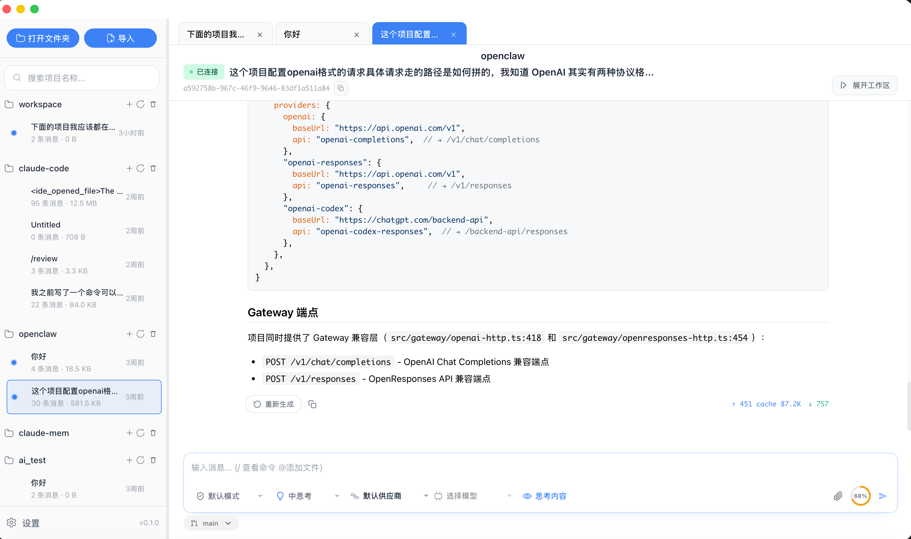
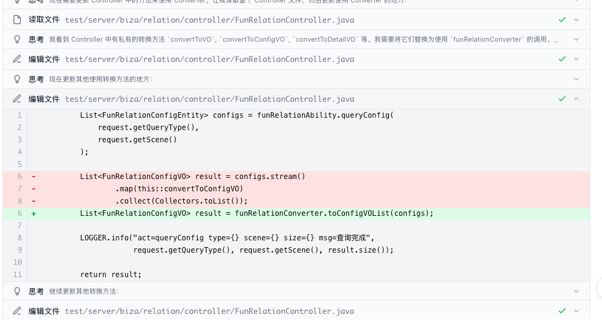
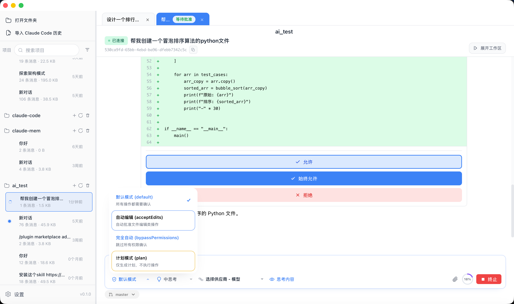
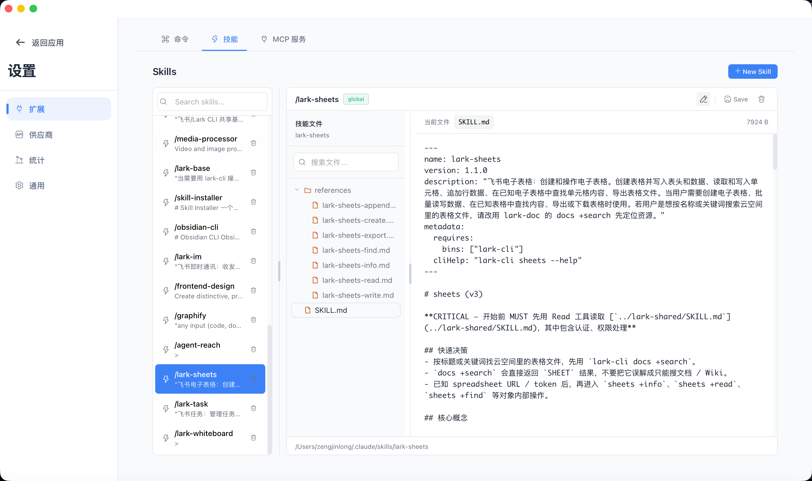
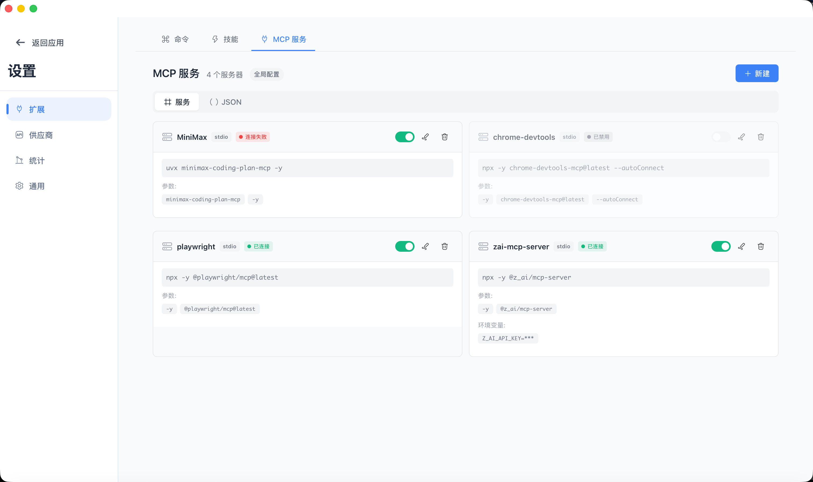
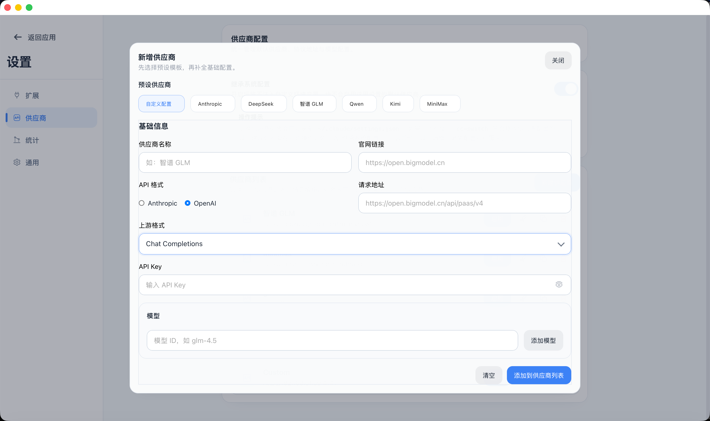

# Aite

### 面向 Claude Code 的桌面客户端

**[中文](README.md)** | **[English](README_EN.md)**

  <a href="#功能">功能</a> ·
  <a href="#桌面端">页面截图</a> ·
  <a href="#架构概览">架构概览</a> ·
  <a href="#快速开始">快速开始</a> ·
  <a href="#更多文档">更多文档</a>

## Aite 是什么

Aite 是一个围绕 Claude Code 日常使用体验打造的桌面客户端。

通过桌面化的多项目管理、流畅的历史消息浏览和清晰的工具调用可视化，让 Claude Code 的使用体验更加高效便捷。

## 桌面端预览

<table>
  <tr>
    <td align="center" width="50%">
      
       
      <b style="font-size: 16px;">主界面</b>
    </td>
    <td align="center" width="50%">
      
       
      <b style="font-size: 16px;">工具调用&diff</b>
    </td>
  </tr>
  <tr>
    <td align="center" width="50%">
      
       
      <b style="font-size: 16px;">权限审核</b>
    </td>
    <td align="center" width="50%">
      
       
      <b style="font-size: 16px;">skill管理</b>
    </td>
  </tr>
  <tr>
    <td align="center" width="50%">
      
       
      <b style="font-size: 16px;">mcp管理</b>
    </td>
    <td align="center" width="50%">
      
       
      <b style="font-size: 16px;">Anthropic&openai协议供应商管理</b>
    </td>
  </tr>
</table>

## 快速开始

### 前置要求
- [Claude Code](https://github.com/anthropics/claude-code) — Aite 依赖claude code cli, Aite会帮助检测与安装。

### 下载
macos系统
从 [Releases](https://github.com/qlql489/aite/releases) 下载`.dmg`文件，双击安装
同时支持 Apple Silicon (arm64) 和 Intel (x86_64)

window系统
从 [Releases](https://github.com/qlql489/aite/releases) 下载`.msi` 安装包运行

## 主要功能

### 🔄 多项目与会话管理
告别命令行窗口切换，统一管理本地项目和 Claude Code 会话
- 本地项目快速导入与切换
- 会话创建、恢复与持久化
- 历史会话搜索与快速回溯

### 💬 消息与工具可视化
让 Claude Code 的每一次调用都清晰可见
- 流式展示 thinking、工具调用、子代理、图片等全类型消息
- 工具调用结构化呈现，Edit/Write 支持 diff 视图
- 权限请求在聊天流中直接审批，支持批准/拒绝/始终允许
- 待办事项可视化展示进度与完成状态

### 📁 文件与代码协同
无缝集成本地项目工作流
- `@` 文件引用，支持目录、图片和附件上传
- 工作区目录树查看与内联文件编辑
- Git 状态、分支与变更信息集成
- VSCode IDE 上下文注入支持

### ⚙️ 配置与扩展管理
可视化界面替代命令行配置
- MCP Server、skills、commands 统一管理
- 模型切换与思考强度选择
- 支持接入自定义大模型（兼容 Anthropic/OpenAI 协议）
- Token usage 统计与 CLI 参数配置

## 架构概览

- **桌面容器**：基于 Tauri 2.0 构建，兼顾安装体积、启动速度与跨平台能力
- **前端界面**：使用 Vue 3 + TypeScript + Vite 构建桌面客户端交互层
- **本地能力桥接**：通过 Rust 与 Node Backend 协作处理 CLI、文件、Git 与 Provider Bridge 等本地能力
- **状态与展示**：使用 Pinia 组织状态，结合 Markdown 渲染、代码高亮与工具调用视图完成消息可视化

## 技术栈

Aite 采用现代化的桌面应用技术栈，确保轻量、高效与跨平台兼容性

| 层级 | 技术选型 |
|------|----------|
| **桌面框架** | [Tauri 2.0](https://tauri.app) — 基于 Rust 的轻量级桌面框架 |
| **前端** | Vue 3 + TypeScript + Vite |
| **状态管理** | Pinia |
| **UI 图标** | HugeIcons |
| **后端** | Rust (Tokio 异步运行时) |
| **Markdown 渲染** | marked + DOMPurify |
| **代码高亮** | highlight.js |

## 后续计划

- 🖥️ **Computer Use** — 支持 Claude 桌面自动化操作
- ⏰ **定时任务** — 支持 cron 表达式定时执行命令
- 📱 **飞书集成** — 支持飞书消息、日历、文档等 API 调用

## 环境变量

当前版本优先通过 Aite 图形界面管理 Claude Code、模型提供商、MCP Server 与 CLI 参数配置。

如果你只是正常使用桌面端，通常不需要手动维护复杂环境变量；后续如补充独立文档，这里也可以继续扩展。

## FAQ

### Aite 依赖什么运行？

依赖本地已安装的 [Claude Code](https://github.com/anthropics/claude-code)，首次打开时会协助检测与安装。

### Aite 适合什么场景？

适合需要频繁切换项目、回看历史消息、查看工具调用细节，以及希望把 Claude Code 放到桌面工作流里使用的场景。

## 全局使用

Aite 本身是桌面客户端，推荐直接通过图形界面管理会话与项目；如果你习惯命令行工作流，也可以将它与本地 Claude Code CLI 配合使用。

## 更多文档

- 文档目录：[`docs/`](docs)
- 本地预览：`npm run docs:dev`
- GitHub Pages：<https://qlql489.github.io/aite/>

### 作者

本软件完全由 [qlql489](https://github.com/qlql489/aite) 独立开发

## 联系我

本项目完全由 [qlql489](https://github.com/qlql489/aite) 利用业余时间独立开发,欢迎企业或个人赞助支持项目迭代；如果你有定制开发、系统集成或商务合作需求，也欢迎联系交流。

## 交流群

欢迎扫码加入交流群，一起交流使用体验、反馈问题和讨论后续功能。

## 💰 打赏支持

如果这个项目帮到你，可以支持一下：

